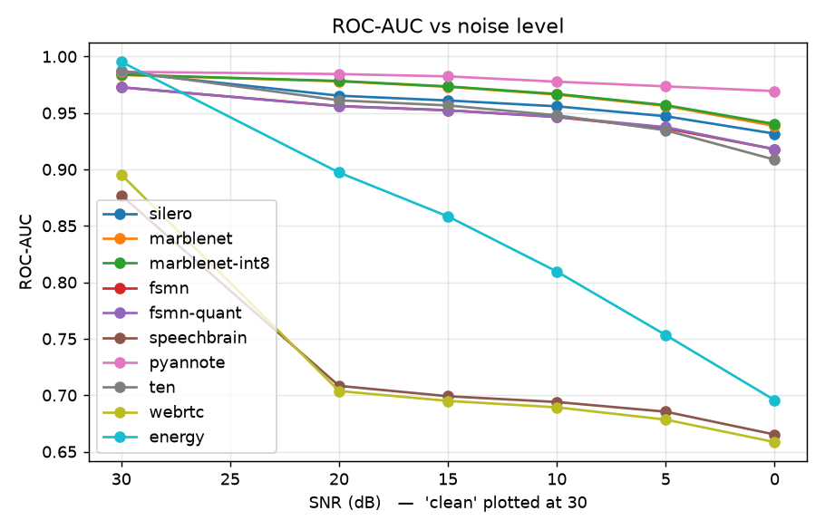
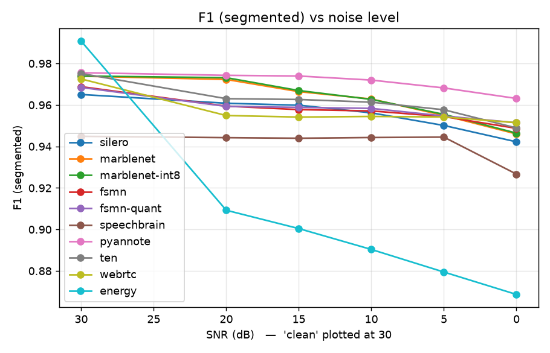
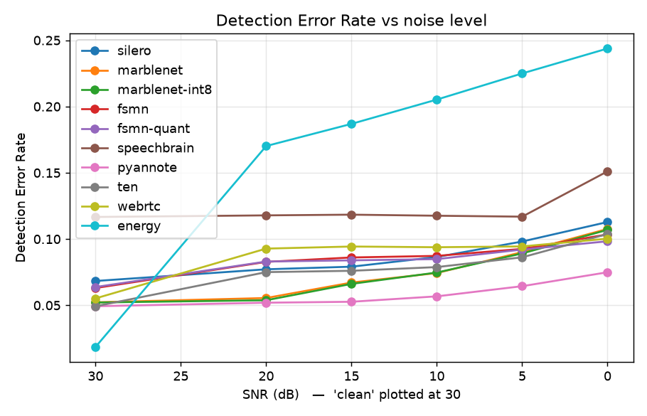
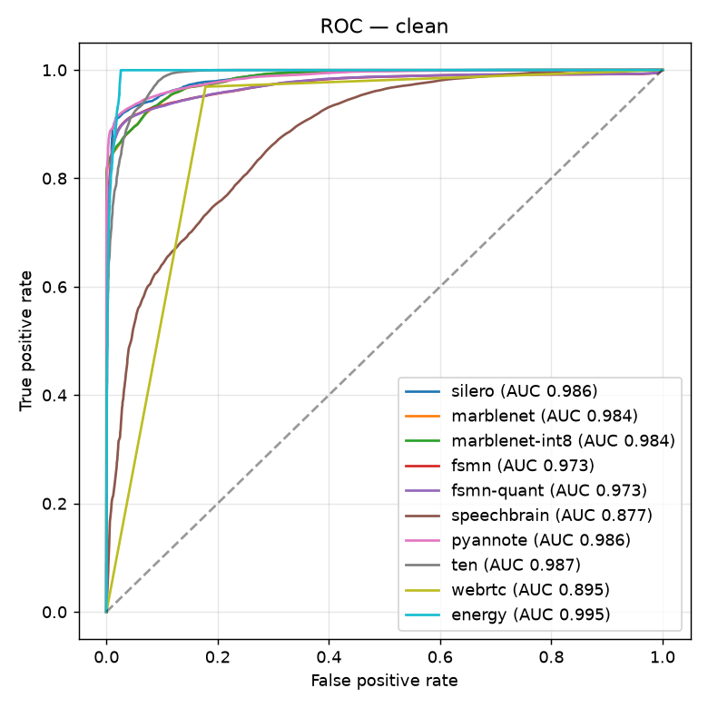
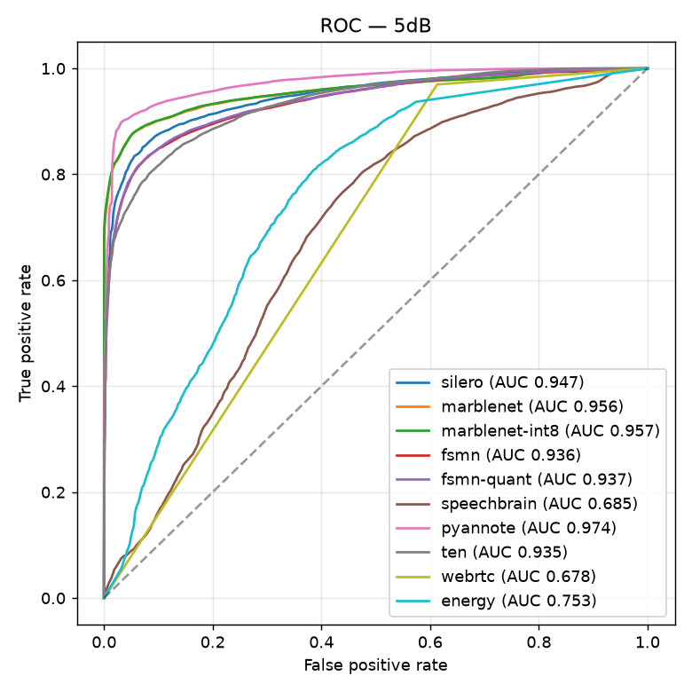
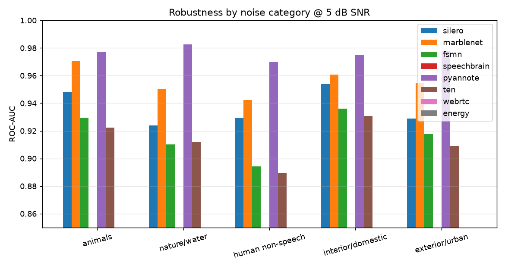

# vadonnx VAD benchmark

**Dataset:** LibriSpeech dev-clean + ESC-50 noise (synthetic SNR sweep)
**Setup:** 80 LibriSpeech dev-clean utterances concatenated with silence
gaps and mixed with real ESC-50 background noise at controlled SNRs. Each condition is
~585s (89% speech). All models are scored
on a common 10 ms frame grid against exact reference labels.

**Metrics**
- **ROC-AUC** — threshold-independent, from raw per-frame speech probabilities.
- **F1 / FA / Miss / DER** — at each model's deployed operating point
  (`get_speech_segments` with default smoothing). DER = (false-alarm + miss) / speech.

## ROC-AUC by condition (higher is better)

| model | clean | 20dB | 15dB | 10dB | 5dB | 0dB | mean |
|---|---|---|---|---|---|---|---|
| silero | 0.9861 | 0.9653 | 0.9611 | 0.9559 | 0.9471 | 0.9317 | **0.9579** |
| marblenet | 0.9837 | 0.9780 | 0.9731 | 0.9663 | 0.9562 | 0.9385 | **0.9660** |
| marblenet-int8 | 0.9839 | 0.9783 | 0.9735 | 0.9668 | 0.9569 | 0.9402 | **0.9666** |
| fsmn | 0.9727 | 0.9561 | 0.9524 | 0.9464 | 0.9364 | 0.9179 | **0.9470** |
| fsmn-quant | 0.9727 | 0.9560 | 0.9523 | 0.9467 | 0.9374 | 0.9179 | **0.9472** |
| speechbrain | 0.8770 | 0.7083 | 0.6991 | 0.6940 | 0.6854 | 0.6652 | **0.7215** |
| pyannote | 0.9865 | 0.9845 | 0.9824 | 0.9777 | 0.9736 | 0.9694 | **0.9790** |
| ten | 0.9874 | 0.9612 | 0.9566 | 0.9479 | 0.9347 | 0.9086 | **0.9494** |
| webrtc | 0.8954 | 0.7037 | 0.6949 | 0.6892 | 0.6784 | 0.6585 | **0.7200** |
| energy | 0.9953 | 0.8972 | 0.8584 | 0.8095 | 0.7533 | 0.6956 | **0.8349** |

## F1 (segmented) by condition

| model | clean | 20dB | 15dB | 10dB | 5dB | 0dB | mean |
|---|---|---|---|---|---|---|---|
| silero | 0.965 | 0.961 | 0.960 | 0.956 | 0.950 | 0.942 | **0.956** |
| marblenet | 0.974 | 0.972 | 0.966 | 0.963 | 0.955 | 0.946 | **0.963** |
| marblenet-int8 | 0.974 | 0.973 | 0.967 | 0.963 | 0.955 | 0.946 | **0.963** |
| fsmn | 0.969 | 0.959 | 0.958 | 0.957 | 0.954 | 0.949 | **0.958** |
| fsmn-quant | 0.968 | 0.959 | 0.959 | 0.958 | 0.955 | 0.951 | **0.959** |
| speechbrain | 0.945 | 0.944 | 0.944 | 0.944 | 0.944 | 0.927 | **0.941** |
| pyannote | 0.976 | 0.974 | 0.974 | 0.972 | 0.968 | 0.963 | **0.971** |
| ten | 0.975 | 0.963 | 0.963 | 0.961 | 0.958 | 0.949 | **0.961** |
| webrtc | 0.973 | 0.955 | 0.954 | 0.954 | 0.954 | 0.951 | **0.957** |
| energy | 0.991 | 0.909 | 0.900 | 0.890 | 0.879 | 0.869 | **0.906** |

## Detection Error Rate by condition (lower is better)

| model | clean | 20dB | 15dB | 10dB | 5dB | 0dB | mean |
|---|---|---|---|---|---|---|---|
| silero | 0.068 | 0.077 | 0.079 | 0.086 | 0.098 | 0.113 | **0.087** |
| marblenet | 0.052 | 0.056 | 0.067 | 0.074 | 0.090 | 0.108 | **0.075** |
| marblenet-int8 | 0.052 | 0.054 | 0.066 | 0.075 | 0.089 | 0.107 | **0.074** |
| fsmn | 0.063 | 0.083 | 0.086 | 0.087 | 0.093 | 0.104 | **0.086** |
| fsmn-quant | 0.064 | 0.083 | 0.084 | 0.085 | 0.092 | 0.098 | **0.084** |
| speechbrain | 0.117 | 0.118 | 0.118 | 0.118 | 0.117 | 0.151 | **0.123** |
| pyannote | 0.049 | 0.052 | 0.053 | 0.057 | 0.064 | 0.075 | **0.058** |
| ten | 0.049 | 0.075 | 0.076 | 0.079 | 0.086 | 0.104 | **0.078** |
| webrtc | 0.055 | 0.093 | 0.094 | 0.094 | 0.094 | 0.100 | **0.088** |
| energy | 0.019 | 0.170 | 0.187 | 0.205 | 0.225 | 0.244 | **0.175** |

## ROC curves

| clean | 5 dB |
|---|---|
|  |  |

## Real-time factor (CPU, 1 thread)

| model | clean | 20dB | 15dB | 10dB | 5dB | 0dB | mean |
|---|---|---|---|---|---|---|---|
| silero | 0.0079 | 0.0071 | 0.0071 | 0.0073 | 0.0071 | 0.0070 | **0.0072** |
| marblenet | 0.0033 | 0.0032 | 0.0032 | 0.0031 | 0.0031 | 0.0031 | **0.0032** |
| marblenet-int8 | 0.0090 | 0.0093 | 0.0093 | 0.0090 | 0.0090 | 0.0088 | **0.0091** |
| fsmn | 0.0080 | 0.0077 | 0.0078 | 0.0075 | 0.0075 | 0.0076 | **0.0077** |
| fsmn-quant | 0.0074 | 0.0070 | 0.0072 | 0.0072 | 0.0073 | 0.0073 | **0.0072** |
| speechbrain | 0.0140 | 0.0135 | 0.0137 | 0.0143 | 0.0145 | 0.0142 | **0.0140** |
| pyannote | 0.0077 | 0.0078 | 0.0076 | 0.0078 | 0.0078 | 0.0077 | **0.0077** |
| ten | 0.0353 | 0.0374 | 0.0383 | 0.0329 | 0.0371 | 0.0376 | **0.0364** |
| webrtc | 0.0009 | 0.0009 | 0.0009 | 0.0009 | 0.0009 | 0.0009 | **0.0009** |
| energy | 0.0002 | 0.0002 | 0.0002 | 0.0002 | 0.0002 | 0.0002 | **0.0002** |

## Analysis

Averaged over all conditions, **pyannote** has the highest ROC-AUC.

- **silero**: clean AUC 0.986 → 0 dB 0.932 (Δ0.054); mean RTF 0.0072.
- **marblenet**: clean AUC 0.984 → 0 dB 0.939 (Δ0.045); mean RTF 0.0032.
- **marblenet-int8**: clean AUC 0.984 → 0 dB 0.940 (Δ0.044); mean RTF 0.0091.
- **fsmn**: clean AUC 0.973 → 0 dB 0.918 (Δ0.055); mean RTF 0.0077.
- **fsmn-quant**: clean AUC 0.973 → 0 dB 0.918 (Δ0.055); mean RTF 0.0072.
- **speechbrain**: clean AUC 0.877 → 0 dB 0.665 (Δ0.212); mean RTF 0.0140.
- **pyannote**: clean AUC 0.986 → 0 dB 0.969 (Δ0.017); mean RTF 0.0077.
- **ten**: clean AUC 0.987 → 0 dB 0.909 (Δ0.079); mean RTF 0.0364.
- **webrtc**: clean AUC 0.895 → 0 dB 0.658 (Δ0.237); mean RTF 0.0009.
- **energy**: clean AUC 0.995 → 0 dB 0.696 (Δ0.300); mean RTF 0.0002.

## Real-world cross-check — VoxConverse dev

VoxConverse dev (real conversational, RTTM refs) — 40 clips, 232 min, 92% speech.
This is genuine in-the-wild multi-speaker conversational audio (reference = union of RTTM
speaker turns), so numbers are lower and more realistic than the synthetic sweep.

| model | ROC-AUC | F1 | DER | FA | Miss |
|---|---|---|---|---|---|
| silero | 0.9513 | 0.963 | 0.076 | 0.248 | 0.043 |
| marblenet | 0.9584 | 0.973 | 0.053 | 0.315 | 0.027 |
| fsmn | 0.9420 | 0.968 | 0.081 | 0.456 | 0.017 |
| speechbrain | 0.7115 | 0.965 | 0.083 | 0.752 | 0.012 |
| pyannote | 0.9703 | 0.965 | 0.148 | 0.424 | 0.013 |
| ten | 0.9363 | 0.963 | 0.077 | 0.440 | 0.031 |
| webrtc | 0.7233 | 0.950 | 0.175 | 0.543 | 0.029 |
| energy | 0.7976 | 0.886 | 0.270 | 0.266 | 0.160 |

## Robustness by noise category (ROC-AUC @ 5 dB)

| model | animals | nature/water | human non-speech | interior/domestic | exterior/urban |
|---|---|---|---|---|---|
| silero | 0.9479 | 0.9238 | 0.9294 | 0.9538 | 0.9289 |
| marblenet | 0.9709 | 0.9502 | 0.9424 | 0.9607 | 0.9549 |
| fsmn | 0.9296 | 0.9103 | 0.8942 | 0.9360 | 0.9177 |
| speechbrain | 0.6821 | 0.6694 | 0.6581 | 0.6921 | 0.6651 |
| pyannote | 0.9773 | 0.9826 | 0.9697 | 0.9749 | 0.9777 |
| ten | 0.9223 | 0.9121 | 0.8897 | 0.9308 | 0.9091 |
| webrtc | 0.6688 | 0.6433 | 0.6452 | 0.6726 | 0.6408 |
| energy | 0.8155 | 0.7857 | 0.7726 | 0.8142 | 0.7808 |

All backends are weakest on **human non-speech** noise (babble-like: laughter, coughing,
crying) — the hardest case for VAD since it is spectrally speech-like — and strongest on
**interior/domestic** sounds.

### Notes
- The synthetic sweep uses exact labels; utterance-internal pauses count as speech, so it
  measures speech/silence discrimination and noise robustness. **VoxConverse** provides the
  in-the-wild reference.
- **AVA-Speech** scoring is supported (`datasets.load_ava_speech` + label CSV); its audio
  is fetched separately from YouTube via `yt-dlp`.
- `int8` variants show the accuracy difference from quantization.
- `ten` requires TEN's native feature extractor and is not scored here.
